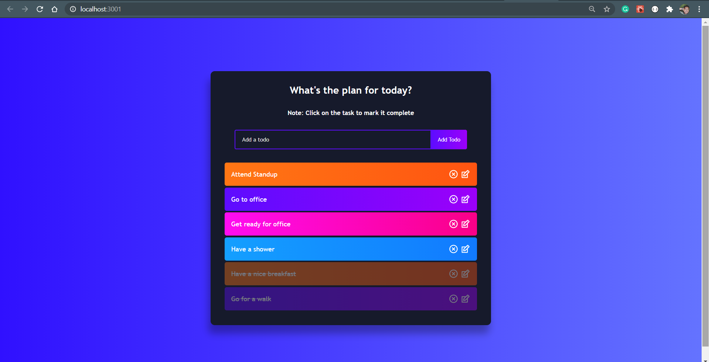
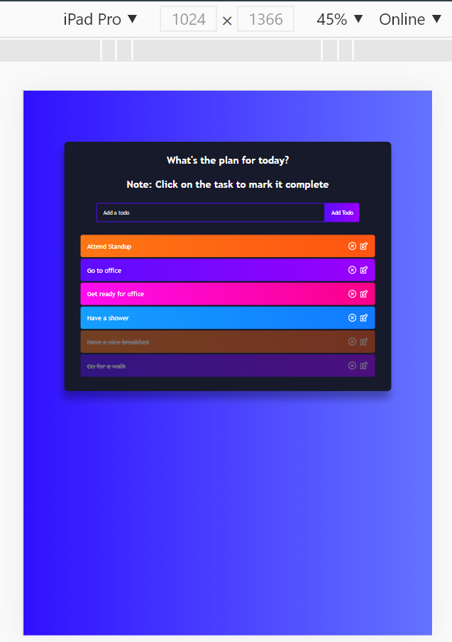
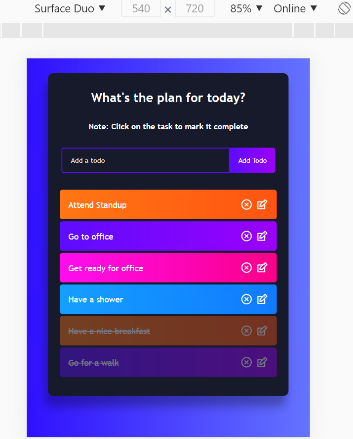
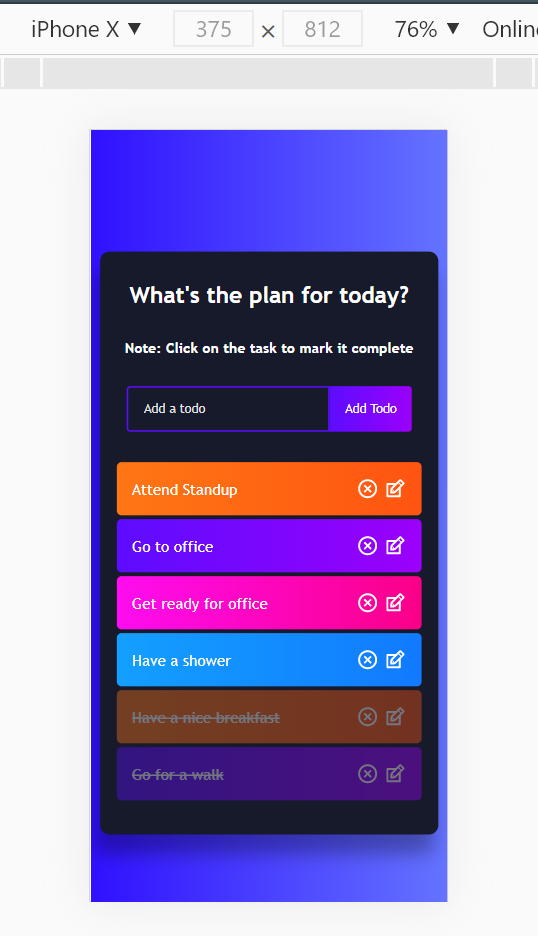

# React Todo-list App

A simple or fancy todo-list built using react & react-hooks. You can update, delete, and mark complete the tasks you have done.
Completed tasks are striked-out and are shown as faded.

Using useRef, useState & useEffect.
Completely responsive UI even supporting surface duo devices.

[Live Demo: https://react-fancytodolist-547c1a.netlify.app/](https://react-fancytodolist-547c1a.netlify.app/)

